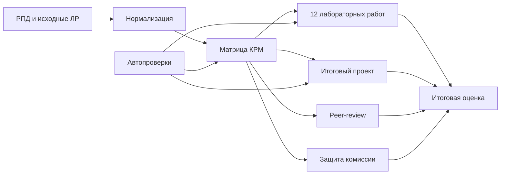

# Архитектура фонда оценочных средств

## Компоненты

1. **Входные данные** — `meta/` и `meta/inputs.md`.
2. **Нормативное описание** — паспорт, матрица и регламенты в `docs/`.
3. **Машиночитаемая модель** — YAML/CSV в `data/competency_map/`.
4. **Рубрики** — шкалы оценивания в `src/rubrics/`.
5. **Формы** — заполняемые шаблоны в `src/templates/`.
6. **Лабораторный контур** — 12 спецификаций в `docs/matrix.md` и расчёт часов.
7. **Контроль качества** — `tests/`, `tests/`, GitHub Actions.
8. **Валидация** — пилотные прогоны и отчёт в `validation/`.
9. **Релиз** — инструкции и печатные формы в `release/`.

## Поток оценивания

## Правило единого источника

- часы и индикаторы берутся из РПД;
- требования конкретной лабораторной работы берутся из её исходного DOCX;
- шкала 0–10 и формула оценки берутся из данного ФОС;
- при конфликте создаётся ADR и обновляются тесты.
